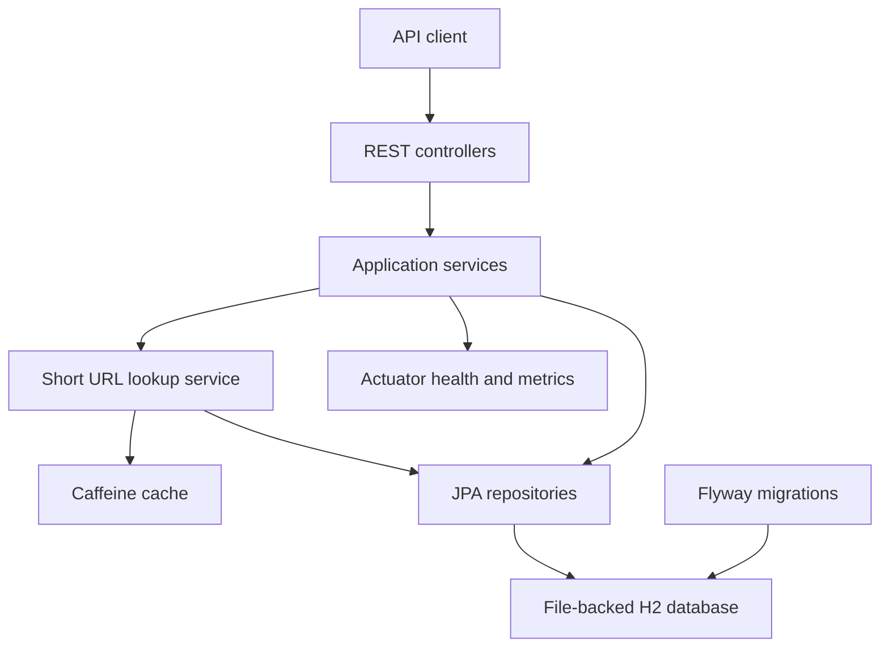
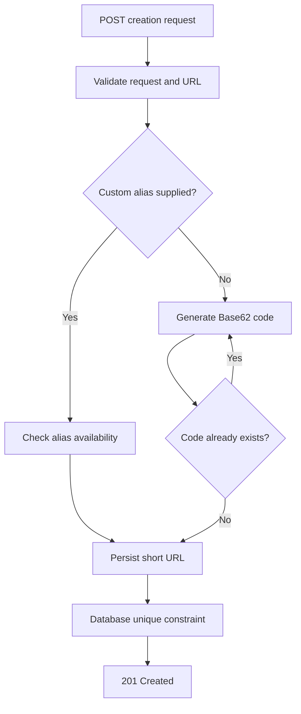
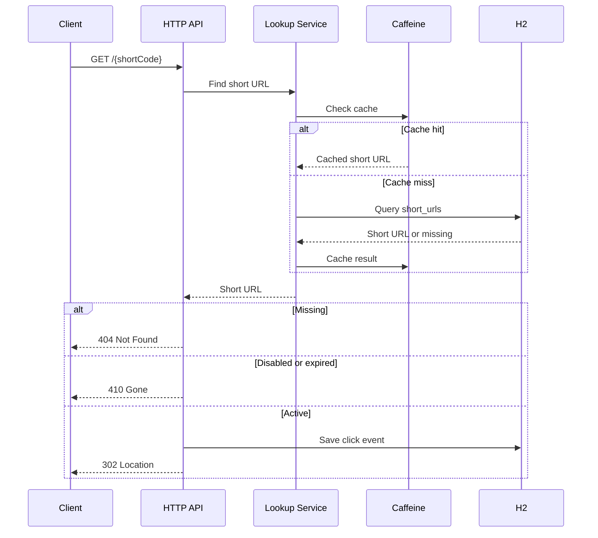

# Architecture

## 1. Purpose

This document describes the architecture, components, control flows, data model, technology choices, validation controls, caching behavior, transaction boundaries, risks, trade-offs, and production evolution of the URL Shortener.

The application is a production-style, locally runnable prototype. It demonstrates modular design and safe engineering practices without requiring PostgreSQL, Redis, Kafka, or other externally installed infrastructure.

## 2. Architectural Goals

The architecture is designed to provide:

- Clear separation between HTTP, application, domain, and persistence responsibilities
- Persistent storage across application restarts
- Reviewable database schema evolution
- Fast repeated short-code lookups
- Controlled behavior for missing, expired, and disabled URLs
- Database-enforced alias uniqueness
- Immediate analytics consistency
- Consistent API error responses
- Automated unit, integration, cache, and concurrency validation
- A documented path from the local prototype to a distributed production system

## 3. Scope

The implemented scope includes:

- Creating short URLs
- Generating Base62 short codes
- Supporting optional custom aliases
- Supporting optional expiration timestamps
- Redirecting active short URLs
- Retrieving URL metadata
- Recording successful redirect events
- Retrieving click analytics
- Disabling URLs through soft deletion
- Persisting records across application restarts
- Caching short-code lookups
- Evicting cache entries when URLs are disabled
- Exposing application health and standard metrics
- Returning controlled API errors

## 4. Non-Goals

The following capabilities are intentionally outside the local prototype scope:

- Authentication and authorization
- Per-user URL ownership
- PostgreSQL
- Redis
- Kafka or another message broker
- Distributed rate limiting
- Multi-instance deployment
- Multi-region deployment
- Geographic or device analytics
- Browser-based administration UI
- Malicious-domain reputation checking
- Bot detection
- Production secrets management
- High availability and automated database failover

These capabilities are documented as production-evolution recommendations rather than partially implemented features.

## 5. Architecture Style

The application uses a layered modular monolith.

This style was selected because it provides clear responsibility boundaries while avoiding the operational complexity of multiple deployable services for a limited prototype.

The primary layers are:

1. API layer
2. Application-service layer
3. Domain layer
4. Persistence and infrastructure layer
5. Database and cache
6. Operational monitoring

## 6. Component Diagram



## 7. Component Responsibilities

| Component | Responsibility |
|---|---|
| `UrlController` | Create URLs, retrieve metadata, retrieve analytics, and disable URLs |
| `RedirectController` | Resolve short codes and return HTTP `302 Found` responses |
| `UrlShorteningService` | Validate creation requests, select aliases or generated codes, persist records, retrieve metadata, and disable URLs |
| `RedirectService` | Validate redirect eligibility, record click events, and return original destinations |
| `AnalyticsService` | Return total clicks and most recent access time |
| `ShortUrlLookupService` | Resolve short codes through Caffeine and the repository |
| `ShortCodeGenerator` | Generate configurable Base62 codes using `SecureRandom` |
| `UrlValidator` | Validate URL syntax, scheme, host, and blocked local destinations |
| `ShortUrlRepository` | Persist and query short URL records |
| `ClickEventRepository` | Persist click events and calculate analytics |
| `GlobalExceptionHandler` | Convert validation and domain exceptions into consistent API errors |
| `CacheConfig` | Enable Spring caching |
| `ApplicationConfig` | Provide a UTC `Clock` for deterministic time handling and testing |
| Flyway | Create and evolve the database schema |
| H2 | Persist short URLs and click events |
| Caffeine | Cache frequently accessed short-code lookups |
| Actuator | Expose health and standard application metrics |

## 8. Package Structure

```text
com.interview.urlshortener
├── api
│   ├── UrlController
│   ├── RedirectController
│   ├── GlobalExceptionHandler
│   └── dto
│       ├── CreateShortUrlRequest
│       ├── ShortUrlResponse
│       ├── AnalyticsResponse
│       └── ApiError
├── application
│   ├── UrlShorteningService
│   ├── RedirectService
│   ├── AnalyticsService
│   ├── ShortUrlLookupService
│   ├── ShortCodeGenerator
│   └── UrlValidator
├── domain
│   ├── ShortUrl
│   ├── ClickEvent
│   └── exception
├── infrastructure
│   ├── config
│   └── persistence
└── UrlShortenerApplication
```

Controllers remain thin. Business decisions are handled by application and domain classes. Persistence behavior remains behind repository interfaces.

## 9. URL Creation Flow

The URL creation flow is:

1. The client sends `POST /api/v1/urls`.
2. Bean Validation checks required fields, lengths, and alias format.
3. `UrlValidator` validates URL syntax, scheme, host, and blocked local destinations.
4. The service verifies that expiration, when supplied, is in the future.
5. If a custom alias is supplied, the service checks its availability.
6. If no custom alias is supplied, `ShortCodeGenerator` creates a Base62 code.
7. The application performs an availability check.
8. The short URL is persisted.
9. The database unique constraint remains the final concurrency safeguard.
10. The API returns `201 Created`, a `Location` header, and URL metadata.

### Creation Control Flow



The initial availability check provides a controlled application response. The database unique constraint protects against concurrent requests that pass the availability check simultaneously.

## 10. Redirect Flow

The redirect flow is:

1. The client sends `GET /{shortCode}`.
2. The controller delegates to `RedirectService`.
3. `RedirectService` calls `ShortUrlLookupService`.
4. Spring checks Caffeine for the short code.
5. On a cache miss, the repository queries H2.
6. A missing code results in `404 Not Found`.
7. The redirect service checks active state and expiration after lookup.
8. An expired or disabled URL results in `410 Gone`.
9. A successful redirect creates a click event.
10. The controller returns `302 Found` with the original URL in the `Location` header.

### Redirect Sequence



## 11. Metadata Flow

Metadata retrieval uses:

```text
GET /api/v1/urls/{shortCode}
```

The service queries the repository and returns:

- Short code
- Short URL
- Original URL
- Creation timestamp
- Optional expiration timestamp
- Active state

A missing short code returns `404 Not Found`.

Metadata remains available after soft deletion so that existing records and analytics can still be reviewed.

## 12. Analytics Flow

Analytics retrieval uses:

```text
GET /api/v1/urls/{shortCode}/analytics
```

A successful redirect synchronously saves a click event before returning the redirect response.

The analytics service returns:

- Short code
- Total successful redirect count
- Most recent successful access time

The following requests do not create business click events:

- Missing short codes
- Expired URLs
- Disabled URLs
- Invalid requests

All timestamps use UTC.

## 13. Disable Flow

Disabling uses:

```text
DELETE /api/v1/urls/{shortCode}
```

The operation performs a soft delete:

1. Retrieve the record.
2. Set `active=false`.
3. Commit the change.
4. Evict the corresponding Caffeine entry.
5. Return `204 No Content`.

After disabling:

- Redirect returns `410 Gone`.
- Metadata remains available.
- Analytics remain available.
- The database record is preserved.

## 14. Data Model

### `short_urls`

| Column | Type | Purpose |
|---|---|---|
| `id` | `BIGINT` | Primary key |
| `short_code` | `VARCHAR(32)` | Generated code or custom alias |
| `original_url` | `VARCHAR(2048)` | Original destination URL |
| `created_at` | Timestamp with time zone | UTC creation time |
| `expires_at` | Timestamp with time zone, nullable | Optional expiration |
| `active` | Boolean | Soft-delete state |
| `version` | `BIGINT` | Optimistic-lock version |

Controls:

- Primary key on `id`
- Unique constraint on `short_code`
- Non-null constraints on required fields
- Optimistic locking through `@Version`

### `click_events`

| Column | Type | Purpose |
|---|---|---|
| `id` | `BIGINT` | Primary key |
| `short_url_id` | `BIGINT` | Foreign key to `short_urls` |
| `clicked_at` | Timestamp with time zone | UTC redirect time |
| `referrer` | `VARCHAR(1024)`, nullable | Optional referring page |
| `user_agent` | `VARCHAR(512)`, nullable | Truncated client user agent |
| `ip_hash` | `VARCHAR(64)`, nullable | SHA-256 hash of the caller IP |

Indexes:

- Unique index on `short_urls.short_code`
- Index on `click_events.short_url_id`
- Index on `click_events.clicked_at`

The schema is created through:

```text
src/main/resources/db/migration/V1__create_url_shortener_schema.sql
```

## 15. Database Strategy

The local application uses:

```text
jdbc:h2:file:./data/urlshortener;MODE=PostgreSQL
```

The automated test profile uses:

```text
jdbc:h2:mem:urlshortener-test;MODE=PostgreSQL;DB_CLOSE_DELAY=-1
```

`MODE=PostgreSQL` enables H2 compatibility behavior. It does not mean PostgreSQL is running.

Flyway owns schema creation and evolution. Hibernate uses:

```yaml
ddl-auto: validate
```

This prevents Hibernate from silently creating or modifying the schema and ensures the entity mappings match the Flyway-controlled database.

## 16. Cache Strategy

Caffeine caches short-code lookup results using:

```text
Cache name: shortUrls
Cache key: shortCode
Maximum size: 10,000 entries
Expiration: 10 minutes after write
```

H2 remains the source of truth. Caffeine stores temporary copies only.

The cached method is located in a dedicated `ShortUrlLookupService`. This is necessary because Spring's default caching mechanism uses proxies and does not intercept calls from one method to another within the same class.

Cache entries are evicted when URLs are disabled.

Expiration and active-state checks occur after cache lookup, preventing a cached value from bypassing redirect eligibility rules.

### Cache Limitations

- Cache entries are local to one application instance.
- Cache entries are lost when the application restarts.
- Multiple application instances would have independent caches.
- Production requires shared caching or a carefully designed invalidation strategy.

## 17. Transaction Boundaries

| Operation | Transaction behavior |
|---|---|
| Create URL | Read/write transaction |
| Retrieve metadata | Read-only transaction |
| Cached lookup | Read-only transaction on cache miss |
| Redirect | Read/write transaction because a click event is persisted |
| Retrieve analytics | Read-only transaction |
| Disable URL | Read/write transaction followed by cache eviction |

`spring.jpa.open-in-view` is disabled so persistence access remains within explicit application transaction boundaries.

## 18. Validation Controls

### Request validation

Bean Validation enforces:

- URL is required.
- URL length does not exceed 2,048 characters.
- Custom alias is optional.
- Custom alias contains 4–32 permitted characters.
- Alias characters are limited to letters, digits, underscore, and hyphen.

Alias pattern:

```regex
^[A-Za-z0-9_-]{4,32}$
```

### Domain validation

`UrlValidator` enforces:

- URL syntax must be valid.
- Scheme must be HTTP or HTTPS.
- Host must be present.
- Explicitly blocked local hosts are rejected.

Expiration must be later than the current UTC time.

### Validation limitations

The local validation does not provide complete protection against:

- DNS rebinding
- Every private or reserved IP range
- Malicious public domains
- Phishing destinations
- Domain reputation changes

A production system requires network controls, reputation services, abuse monitoring, and trusted proxy configuration.

## 19. Error Handling

`GlobalExceptionHandler` returns consistent API errors without exposing stack traces or database details.

| Condition | Status |
|---|---:|
| Invalid request | `400 Bad Request` |
| Invalid URL | `400 Bad Request` |
| Invalid alias | `400 Bad Request` |
| Past expiration | `400 Bad Request` |
| Missing short code | `404 Not Found` |
| Duplicate custom alias | `409 Conflict` |
| Expired URL | `410 Gone` |
| Disabled URL | `410 Gone` |
| Unexpected internal error | `500 Internal Server Error` |

The API error model includes:

- Timestamp
- HTTP status
- Error name
- Controlled message
- Request path
- Field-level validation errors

## 20. Concurrency Controls

The application uses two levels of collision protection:

1. Application-level availability checking
2. Database-level unique constraint

The database constraint is authoritative because concurrent requests can pass the application check simultaneously.

A concurrency integration test starts multiple threads attempting to create the same custom alias and verifies:

- Exactly one creation succeeds.
- Remaining attempts return conflicts.
- Only one database record is created.

The entity also contains an optimistic-lock version field for controlled concurrent updates.

## 21. Privacy and Security Considerations

Implemented controls include:

- HTTP/HTTPS scheme restriction
- Maximum input lengths
- Controlled error responses
- Unique database constraints
- Non-sequential random short codes
- Raw IP addresses are not stored directly
- User-agent and referrer values are truncated
- Selected Actuator endpoints only
- Local database files excluded from Git
- No credentials or secrets required

Important limitations include:

- The service is an open redirect by design.
- Authentication and ownership are not implemented.
- Unsalted IP hashing is not full anonymization.
- Abuse detection and domain reputation checking are not implemented.
- Distributed rate limiting is not implemented.
- The H2 console is development-only and must not be exposed in production.

## 22. Observability

Spring Boot Actuator exposes selected operational endpoints:

```text
/actuator/health
/actuator/info
/actuator/metrics
```

The prototype provides:

- Application health
- Standard JVM metrics
- Standard HTTP metrics
- Standard datasource metrics
- Startup and application logs

The prototype does not include:

- Centralized log aggregation
- Distributed tracing
- Custom business dashboards
- Alerting
- Prometheus/Grafana deployment
- Production incident management integration

## 23. Technology Decisions

| Decision | Rationale |
|---|---|
| Java and Spring Boot | Mature ecosystem for REST, validation, persistence, testing, caching, and operations |
| Modular monolith | Clear boundaries without unnecessary distributed-system complexity |
| Maven Wrapper | Reproducible build without requiring a local Maven installation |
| H2 file database | Persistent local storage without external installation |
| H2 in-memory test database | Isolated and repeatable automated tests |
| Flyway | Controlled and reviewable schema evolution |
| JPA/Hibernate | Repository abstraction and entity mapping |
| Caffeine | High-performance local cache without Redis |
| SecureRandom Base62 codes | Non-sequential, URL-safe short codes |
| UTC `Instant` and injectable `Clock` | Unambiguous time handling and deterministic tests |
| Synchronous analytics | Immediate consistency and reduced prototype complexity |
| Soft delete | Preserve metadata and analytics |
| OpenAPI | Reviewable HTTP API contract |
| Actuator | Standard application health and operational metrics |

## 24. Production Evolution

| Prototype | Production evolution |
|---|---|
| File-backed H2 | PostgreSQL with pooling, replication, backups, migrations, and failover |
| Local Caffeine cache | Shared Redis cluster with explicit expiration and invalidation |
| No distributed rate limiter | API gateway or Redis-backed rate limiting |
| Synchronous click inserts | Kafka or another durable event pipeline |
| Single application instance | Horizontally scaled stateless instances |
| No authentication | Authenticated ownership and authorization |
| Basic Actuator endpoints | Centralized metrics, logs, traces, dashboards, and alerts |
| Local configuration | Environment configuration and secret management |
| Indefinite analytics | Retention, deletion, privacy, and compliance policies |
| Basic URL validation | Reputation checking, abuse monitoring, reporting, and blocking |
| Local execution | Containerized deployment and automated delivery pipeline |

## 25. Known Architectural Limitations

- H2 provides no high availability.
- Caffeine is not distributed.
- Rate limiting is not implemented.
- Authentication and authorization are not implemented.
- Analytics persistence increases redirect latency.
- Analytics retention is undefined.
- Unsalted IP hashing is not full anonymization.
- Malicious-domain detection is not implemented.
- The prototype has not undergone production load, soak, failover, or penetration testing.
- Multi-instance cache consistency has not been validated.

These limitations are accepted for the local prototype and documented for production evolution.